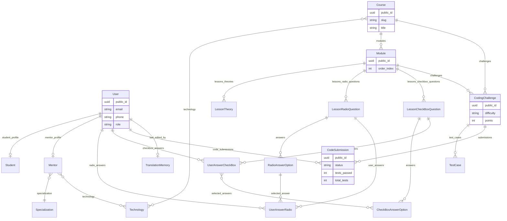
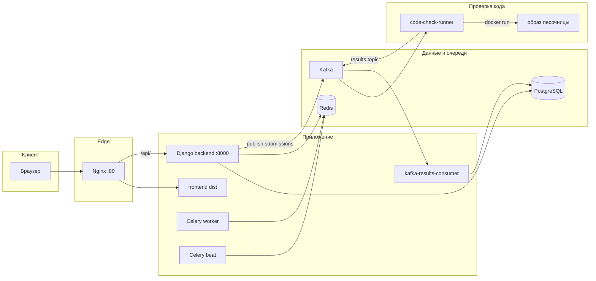

<div align="center">

# Bervinov Academy

**Образовательная платформа** с курсами, интерактивными заданиями, автопроверкой кода (Kafka + Docker-песочница) и современным SPA-фронтендом.

Python **3.11+** · Django · PostgreSQL · Redis · Celery · Kafka · React

</div>

---

<!-- ═══════════════════════════════════════════════════════════════════
     HERO / АНИМАЦИЯ — вставьте сюда демо
     Варианты:
     1) GIF: 
     2) Видео: <video src="docs/images/demo.webm" autoplay muted loop />
     3) Lottie: в README.md напрямую Lottie не рендерится — используйте
        ссылку на страницу или статичный превью-кадр + GIF ниже.
     ═══════════════════════════════════════════════════════════════════ -->

<p align="center">
  <a href="#-быстрый-старт-docker">Запуск</a>
  &nbsp;·&nbsp;
  <a href="#-обновление-проекта">Обновление</a>
  &nbsp;·&nbsp;
  <a href="#-схема-базы-данных">Схема БД</a>
  &nbsp;·&nbsp;
  <a href="#-архитектура-сервисов">Архитектура</a>
  &nbsp;·&nbsp;
  <a href="#-гайд-по-проекту">Гайд</a>
</p>

<p align="center">
  <!-- TODO: положите файл и раскомментируйте строку ниже -->
  <!--  -->
  
</p>

---

## Оглавление

1. [Возможности](#-возможности)
2. [Стек](#-стек)
3. [Структура репозитория](#-структура-репозитория)
4. [Быстрый старт (Docker)](#-быстрый-старт-docker)
5. [Локальная разработка без Docker](#-локальная-разработка-без-docker)
6. [Обновление проекта](#-обновление-проекта)
7. [Схема базы данных](#-схема-базы-данных)
8. [Архитектура сервисов](#-архитектура-сервисов)
9. [Гайд по проекту](#-гайд-по-проекту)
10. [API и документация](#-api-и-документация)
11. [Тесты](#-тесты)
12. [Полезные команды](#-полезные-команды)

---

## Возможности

| Область | Что есть в проекте |
|--------|---------------------|
| **Контент** | Курсы → модули → теория, вопросы с одним/несколькими ответами, задачи по программированию с тест-кейсами |
| **Прогресс** | Ответы пользователя, отправки кода, статусы проверки |
| **Автопроверка кода** | Django публикует заявки в Kafka → воркер `code-check-runner` гоняет решение в Docker-образе песочницы → результаты обратно в Kafka → consumer обновляет `CodeSubmission` |
| **Пользователи** | Кастомная модель пользователя (email или телефон), роли студент/ментор/админ, профили `Student` / `Mentor`, специализации |
| **i18n** | Переводы (modeltranslation), память переводов `TranslationMemory` |
| **Админка** | Django Unfold, удобная навигация по сущностям |

---

## Стек

- **Backend:** Django, Django REST Framework, Simple JWT, drf-spectacular, Celery, Redis, kafka-python  
- **БД:** PostgreSQL 15  
- **Очереди / стриминг:** Apache Kafka (Confluent 7.6 + Zookeeper)  
- **Frontend:** React (сборка в статику, раздача через Nginx)  
- **Инфра:** Docker Compose, Nginx как единая точка входа (`/` — фронт, `/api/` — бэкенд)

---

## Структура репозитория

```
BervinovAcademy/
├── backend/                    # Django-проект school_platform
│   ├── users/                  # User, Student, Mentor, Specialization
│   ├── content/                # Курсы, уроки, вопросы, CodingChallenge, TestCase
│   ├── progress/               # Ответы, CodeSubmission, Kafka consumer
│   ├── translations/         # TranslationMemory, Celery-задачи перевода
│   ├── fixture/                # management commands (seed_data)
│   ├── common/                 # UUIDPublicIdMixin и общие утилиты
│   ├── education/ …          # зарезервированные приложения (точка расширения)
│   └── school_platform/      # settings, urls, wsgi
├── frontend/                   # SPA, npm run build → dist/
├── nginx/                      # Прокси /api/, /admin/, статика
├── services/
│   ├── code_check_emulator/    # Kafka consumer → docker run песочницы
│   └── code_check_sandbox/     # Образ для запуска кода
├── scripts/                    # restart-docker, generate-prompt, …
├── docker-compose.yml
├── .env.example
├── requirements.txt
└── pyproject.toml
```

---

## Быстрый старт (Docker)

### Требования

- [Docker Desktop](https://www.docker.com/products/docker-desktop/) (Windows/macOS) или Docker Engine + Compose (Linux)  
- Для **автопроверки кода** воркеру нужен доступ к **Docker socket** (в `docker-compose` это уже смонтировано для `code-check-runner`).

### 1. Окружение

Скопируйте пример и отредактируйте значения:

```bash
cp .env.example .env
```

**Важно для Compose:** в `.env` укажите подключение к БД **как из контейнера backend**:

| Переменная | Пример для `docker compose` |
|------------|-----------------------------|
| `DB_HOST` | `db` |
| `DB_PORT` | `5432` |
| `DB_NAME`, `DB_USER`, `DB_PASSWORD` | Должны совпадать с `POSTGRES_*` у сервиса `db` |

С хоста PostgreSQL доступен на порту **`5433`** (см. `docker-compose.yml`: `5433:5432`), если нужен pgAdmin или миграции с машины.

Для Kafka из контейнеров уже заданы нужные адреса в compose; для скриптов на хосте используйте `localhost:9092` (см. комментарии в `.env.example`).

### 2. Запуск

```bash
docker compose up --build -d
```

После старта:

| URL | Назначение |
|-----|------------|
| http://localhost | Фронтенд (Nginx) |
| http://localhost/api/ | REST API |
| http://localhost/admin/ | Админка Django |
| http://localhost/api/swagger/ | Swagger UI |
| http://localhost/api/redoc/ | ReDoc |

Проверка здоровья бэкенда: `GET http://localhost:8000/health/` (внутри сети compose бэкенд слушает `8000`).

### 3. Наполнение демо-данными

```bash
docker compose exec backend python manage.py seed_data
```

Полный «холодный» перезапуск с очисткой volumes, сборкой, `seed_data` и прогоном тестов (Windows):

```text
scripts\restart-docker.bat
```

На Linux/macOS смотрите `scripts/restart-docker.sh`.

---

## Локальная разработка без Docker

1. Python **3.11+**, виртуальное окружение, `pip install -r requirements.txt` (или `pip install -e .` согласно вашему workflow).  
2. Поднимите PostgreSQL и Redis локально (или только нужные сервисы через compose: `docker compose up -d db redis kafka …`).  
3. В `.env`: `DB_HOST=localhost`, для Postgres из compose — `DB_PORT=5433`.  
4. Из каталога `backend/`:

```bash
python manage.py migrate
python manage.py createsuperuser
python manage.py runserver
```

Фронтенд отдельно (из `frontend/`):

```bash
npm install
npm run dev     # serve на порту 3000 (см. package.json)
```

Учтите CORS и `CSRF_TRUSTED_ORIGINS` / `FRONTEND_URL` в `.env`, если фронт и API на разных портах.

---

## Обновление проекта

Рекомендуемый порядок после `git pull`:

1. **Зависимости**  
   - Backend: обновить venv и `pip install -r requirements.txt`  
   - Frontend: `npm ci` или `npm install` в `frontend/`

2. **Миграции**

```bash
# Docker
docker compose exec backend python manage.py migrate

# Локально (из backend/)
python manage.py migrate
```

3. **Пересборка образов** (если менялись Dockerfile, системные пакеты, `requirements.txt`):

```bash
docker compose build --no-cache backend
docker compose up -d
```

4. **Фронт** в compose собирается сервисом `frontend` и кладётся в `frontend/dist` для Nginx; при изменении только JS/CSS достаточно пересобрать фронт-сервис или выполнить `npm run build` локально и перезапустить `nginx`, если монтируете `dist`.

5. **Kafka / воркеры** — при смене топиков или контрактов сообщений проверьте `.env` и `services/code_check_emulator` на соответствие `docker-compose.yml`.

6. **Жёсткий сброс** (удалит данные БД в volume!) — `docker compose down -v` затем снова `up`.

---

## Схема базы данных

Ниже — **логическая** схема основных таблиц (связи и смысл полей; физические имена таблиц частично заданы через `db_table`, например `users`, `students`).



**UUID `public_id`:** у большинства сущностей для внешнего API используется миксин `UUIDPublicIdMixin` — стабильные публичные идентификаторы вместо внутренних bigint в URL и JSON.

---

## Архитектура сервисов



Кратко по потоку **кода студента:** API создаёт `CodeSubmission` → публикация в топик (по умолчанию `code-submissions`) → `code-check-runner` исполняет тесты в изолированном контейнере → результат в `code-submission-results` → `consume_code_submission_results` обновляет запись в БД.

---

## Гайд по проекту

### Приложения Django

| Приложение | Роль |
|------------|------|
| **users** | Аутентификация по email/телефону, роли, профили студента и ментора, специализации |
| **content** | Весь учебный контент: курс, модуль, типы уроков, `CodingChallenge`, `TestCase` |
| **progress** | Ответы на вопросы, отправки кода, сигналы/интеграция с Kafka |
| **translations** | Память переводов и фоновые задачи для контента с `AutoTranslateMixin` |
| **fixture** | Команда `seed_data` для демонстрационного наполнения |
| **education**, **subscriptions**, **mentoring**, **communication** | Зарегистрированы в `INSTALLED_APPS` как задел под расширение доменной модели |

### Где править что

- **Новый endpoint API:** соответствующие `viewsets.py` / `urls.py` в `users`, `content`, `progress`; корневые маршруты — `backend/school_platform/urls.py`.  
- **Новая сущность в БД:** модель → `makemigrations` → `migrate`; по возможности наследуйте `UUIDPublicIdMixin` для публичного API.  
- **Проверка кода:** лимиты и Docker-образ — `services/code_check_sandbox/` и `services/code_check_emulator/`; переменные топиков — `.env` и `docker-compose.yml`.  
- **Фронт:** `frontend/src/` (роутинг и страницы), сборка — `npm run build` (`build-dist.mjs`).

### Безопасность и продакшен

- Сгенерируйте уникальный `SECRET_KEY`, выключите `DEBUG`, настройте `ALLOWED_HOSTS` и `CSRF_TRUSTED_ORIGINS`.  
- Не коммитьте `.env`; для прода используйте секреты окружения CI/CD или оркестратора.

---

## API и документация

После запуска откройте интерактивную схему:

- **Swagger:** http://localhost/api/swagger/  
- **ReDoc:** http://localhost/api/redoc/  
- **OpenAPI JSON:** http://localhost/api/schema/

---

## Тесты

```bash
# В контейнере backend
docker compose exec backend pytest -v --reuse-db

# Локально из каталога backend (с настроенной БД)
pytest -v
```

---

## Полезные команды

```bash
# Логи
docker compose logs -f backend

# Shell Django
docker compose exec backend python manage.py shell

# Проверка моделей без применения миграций
docker compose exec backend python manage.py makemigrations --check --dry-run

# Только пересборка фронта в compose
docker compose run --rm frontend
```

---

<div align="center">

**Bervinov Academy** — учебная платформа с акцентом на код и прогресс студента.

</div>
